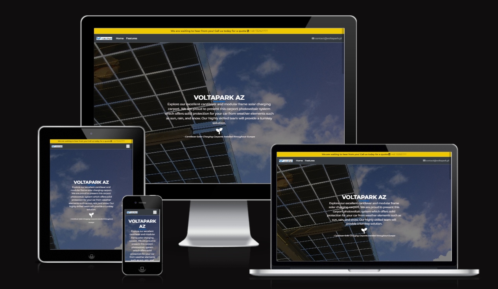
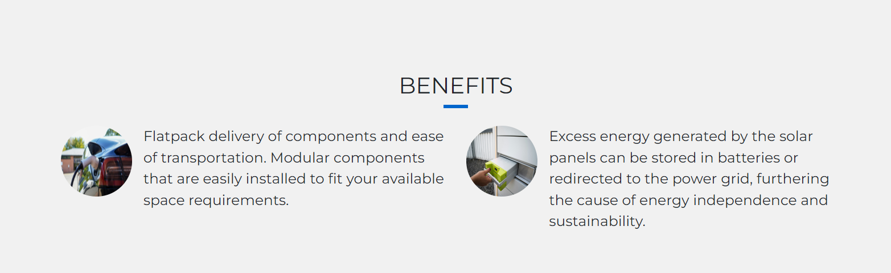
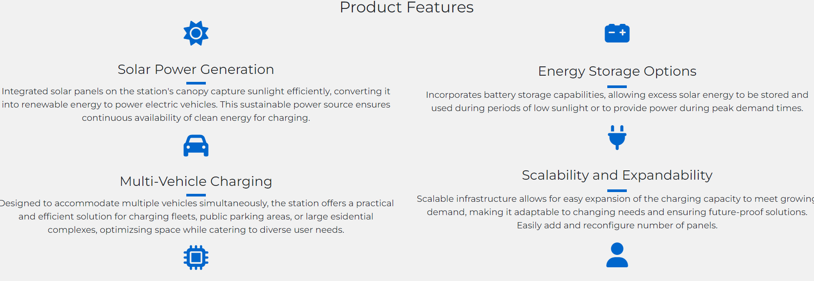

# Ekotera

[Live Site](https://voltapark.pl/)

A solar carport business providing a full installation service for corporate clients across Europe.

[Website Mock-up](https://ui.dev/amiresponsive?url=https://voltapark.pl/)

## Table of contents

- [UX Design](#ux-design)
- [User Stories](#user-stories)
- [Features](#features)
- [Future Features](#future-features)
- [Testing](#testing)
- [Languages Used](#languages-used)
- [Frameworks, Libraries and Programs Used](#frameworks-libraries-and-programs-used)
- [Technologies Used](#technologies-used)
- [Deployment and Publishing](#deployment-and-publishing)
- [Resources](#resources)
- [Credits](#credits)
- [Acknowledgements](#acknowledgements)

## UX Design

Designing the user experience (UX) for a solar carport company involves creating interfaces and interactions that are intuitive, efficient, and enjoyable for users interacting with the company's products or services. Here are some key UX design considerations for a solar carport company:

Clear Information Architecture: Ensure that the structure is organized logically, with easy-to-find information about your solar carport products, services, and contact details. Users should be able to navigate effortlessly to find what they need.

Visual Design: Use a clean and visually appealing design that reflects the eco-friendly nature of solar energy. Incorporate high-quality images and graphics to showcase your solar carport designs and installations. Consistent branding and color schemes help build trust and recognition.

Mobile Responsiveness: Prioritise responsive design to ensure a seamless experience across various screen sizes and orientations.

Educational Content: Offer informative content such as blog posts, articles, or videos that educate users about the benefits of solar energy, the installation process, maintenance tips, and relevant industry trends. This can help users make informed decisions and build trust in your expertise.

Social Proof: Showcase testimonials, case studies, or customer reviews to demonstrate the satisfaction of previous clients and build credibility. User-generated content, such as photos or videos of installed solar carports, can also be compelling.

Accessibility: Ensure that your website or app is accessible to users with disabilities by following best practices for web accessibility. This includes providing alternative text for images, ensuring keyboard navigation, and using color contrasts that are easy to read.

Support and Communication Channels: Offer multiple channels for users to get in touch with your company, such as phone and email. Provide prompt responses to inquiries and offer personalized assistance to address users' specific needs or concerns.

By focusing on these UX design considerations, a solar carport company can create a user-centric experience that engages potential customers, fosters trust, and facilitates conversions.

## Features

Below are descriptions of the main features of the application. Many of the features are based on the Building with Bootstrap module in the Code Institute Fullstack Course.

The page layout, navigation bar, header, footer, colours and fonts have a consistent look and feel on all pages of the website to give the user an intuitive easy to use experience. The navigation bar is responsive on multiple screen sizes - on smaller screens it converts to a 'burger' menu style.

__Colours:__

Image of the colour palette

Accent Colours: Subtle accents of blue #0066CC to add contrast without overpowering the overall design.

Site-wide alert: Gold #eec802

__Fonts:__

Sans-Serif Font 'Montserrat': For body text and readability, a clean and modern sans-serif font used for a contemporary look.

__Accessibility aims:__

The fonts and colours were chosen to meet accessibility standards for readability and contrast, especially for users with visual impairments.

The aim is to maintain consistency in font styles and colours throughout the website for a cohesive and professional appearance.

- Landing page 

    - Sitewide Alert
    Grabs the attention of the user upon landing on the homepage. Noticeable way for users to get in touch with the company.

    -   Favicon
    Displays the company icon in the browsers tab.

    -   Navbar
    Shows the Voltapark logo, Home and Features tabs.
    On a smaller screen condenses to a burger menu.
    Email address to contact the business to the right of the navbar, so that users can click on the email address and write to the company from their own email account.

    - Hero Image with text overlay

    - About section

    Bootstrap card layout changes responsively based on the screen size.

    - Project Section

    Bootstrap card layout changes responsively based on the screen size.

    - Benefits Section

    Bootstrap card layout changes responsively based on the screen size.

- Footer

    An about us section with contact links by phone and email. Font awesome icons to give visual for email and phone.

    Business address and company registration information.

    -   Features Carousel page
    Shows images of the carports in a bootstrap carousel.

    - Features
    Bootstrap columns to detail further product details and benefits.

## Future Features

Interactive Tools: Add interactive tools or calculators that help users estimate the cost savings, environmental impact, or energy production potential of installing a solar carport. These tools can engage users and provide valuable insights.

## Testing

Browser Compatibility PASSED

Browser Compatibility checks were run using BrowserStack and my computer. The results are:

Firefox - ☑

Chrome - ☑

Opera - ☑

Microsoft Edge - ☑

Safari - ☑

__Accessibility Testing__

From using Lighthouse I was able to check the accessibility and SEO of the website. 

By utilising this in DevTools I was able to generate reports for both desktop and mobile. By analysing these reports I was able to make alterations in both the HTML and CSS code to improve the accessibility of the application.

Below are the reports.

    - Homepage

    - Features Page

Navigation Testing

 - Mobile/Tablet Menu PASSED
 - The hamburger menu icon is visible and functions
 - Appropriate links are shown/hidden depending on user
 - All text and icons are visible and appropriate sizes
 - All navigation links successfully direct the user to corresponding pages
 - Desktop Menu PASSED
 - All links highlight and apply intended CSS
 - Appropriate links are shown/hidden depending on user
 - All text and icons are visible and appropriate sizes
 - All navigation links successfully direct the user to corresponding pages
 - Menu successfully opens and closes on press/click
 - All buttons lead to corresponding pages

## Languages Used

- HTML5
- CSS3

## Frameworks, Libraries and Programs Used

- [Google Fonts](https://fonts.google.com/) used for the Montserrat font.
- [Font Awesome](https://fontawesome.com/) was used to add icons for aesthetic and UX purposes.
- [Git](https://git-scm.com/) was used for version control by utilising the Gitpod terminal to commit to Git and Push to GitHub.
- [GitHub](https://github.com/)  is used as the repository for the project code after being pushed from Git.
- [Bootstrap](https://getbootstrap.com/) was used to build responsive web pages
Python Imaging Library used for image handling
- [Balsamiq](https://balsamiq.com/) was used to create the wireframes during the design process.
- [Codeanywhere](https://app.codeanywhere.com/) IDE for the project.
- [GitPod](https://gitpod.io/) IDE used to complete the project.

## Technologies Used

# Resources

[Bootstrap 5 documentation](https://getbootstrap.com/docs/4.6/getting-started/introduction/)

[Favicon](https://favicon.io/) to generate the favicon.

[Looka](https://looka.com/editor/165286831) to create business logo.

## Deployment and Publishing

- Forking and Cloning
To work on your own copy of the code, follow these steps for forking and cloning via GitHub:
In the repository, locate the 'Fork' button at the top right-hand side, adjacent to 'Star'. Click on it to create a new repository, forked from the original.

- To clone the repository, you have two options:
Within the repository, click on the 'Code' dropdown located next to 'Add File' on the right (underneath the Settings tab). From there, choose the option to download all files and save a local copy.
Alternatively, within the same 'Code' dropdown, opt to open the code with GitHub Desktop and proceed with your work from there.

## Resources

__Media__

[Unsplash](Unsplash.com) 
- Hero Image - Image of solar panel Photo by Asia Chang Yr on Unsplash
- Beneifts Images Photos by kumpan-electric-mLxy5nt9Z90 and myenergi-4SyUf9MvWjU on Unsplash

All other images courtesy of Maksym Aleksandrov.

## Credits

Assistance and guideance from Code Institute's Bootstrap Whisky Drop code walkthrough.

## Acknowledgements

Sincere thanks to graphic and CAD designer Maksym Aleksandrov for all his design input in this project.